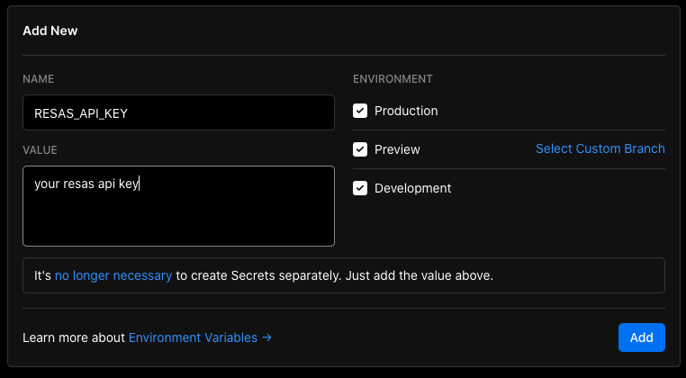

# 都道府県別人口構成グラフ表示


## Demo

- [デモサイト](https://prefectures-population.vercel.app/)

## Getting Started

### 環境変数設定

[RESAS API KEY](https://opendata.resas-portal.go.jp/)を取得して下記の`YOUR_RESAS_API_KEY`を取得済みの API KEY で置き換えてコマンドを実行して下さい。

```sh
echo RESAS_API_KEY=YOUR_RESAS_API_KEY> .env.local
echo RESAS_API_KEY=YOUR_RESAS_API_KEY> .env.test.local
```

### 起動

以下で起動できます。

```bash
npm run dev
# or
yarn dev
```

## Deploy on Vercel

Vercel にデプロイする場合は環境変数に`RESAS_API_KEY`を追加し、取得した API KEY を入力して下さい。


